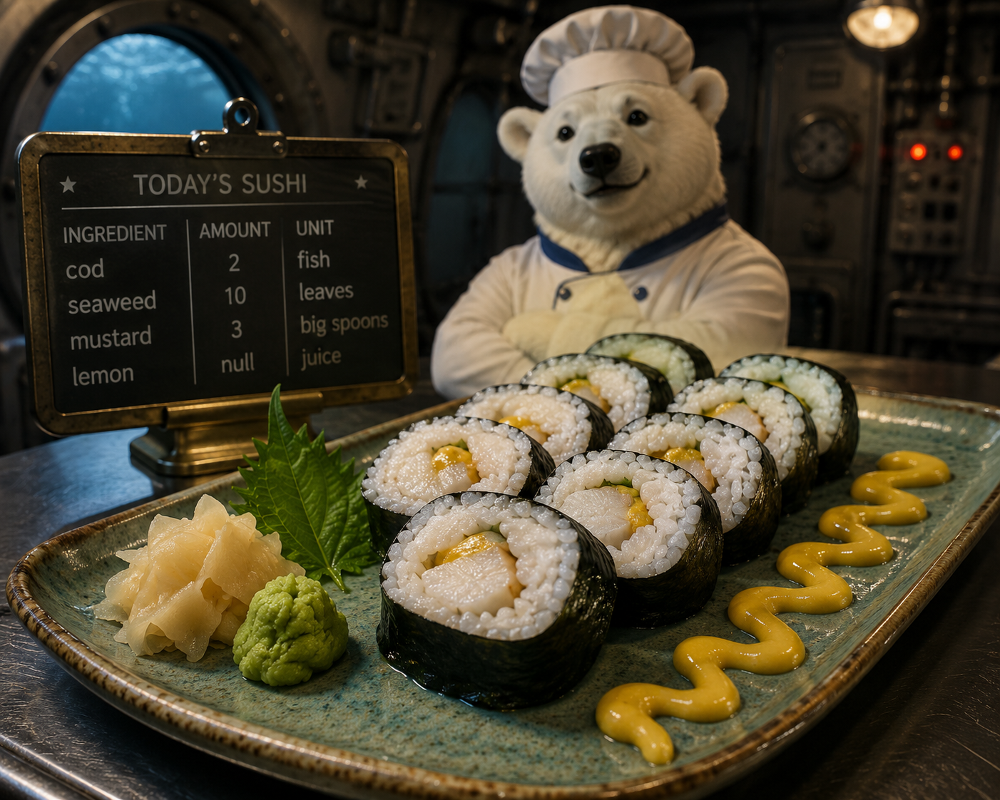

Create DataFrames
=================

.. _create-dataframes-and-series-1:

.. card::
   :shadow: lg

   **In the galley**
   
   Boreaboy, the cook, is according to himself the most important person on the submarine.
   Or do you think the expedition would get anywhere when their bellies are empty?

   Boreaboy is a master of knifes: he slices, dices and chops the ingredients within seconds.
   Often more than one knife is swirling through the air. 
   Of course, nobody should enter the galley while he is preparing food – it could be dangerous.
   
   He has cultivated the preparation of food into a form of art.
   Boreaboy even has his own system by which he writes recipes.

   **Let's see how it works.**

**In this chapter, you will convert Python data structures like lists and dictionaries into pandas types like Series and DataFrames**.

Series from a Python List
-------------------------

Every element of a Python list becomes a position in the Series.

.. code:: python

   import polars as pl

   ingredients = pd.Series(
      ["herring", "onion", "mustard", "pepper"],
   )

Optionally, you may provide a data type:

.. code:: python

   amounts = pl.Series([20, 3, 1, 1], dtype=pl.UInt16)

----

Series from a NumPy array
-------------------------

NumPy arrays convert effortlessly, because, like `polars` Series, they have an underlying in-memory data structure.
This is especially useful to randomize the recipes a little:

.. code:: python

   import numpy as np

   amounts = pl.Series(
      np.random.randint(1, 100, size=4)
   )

What could possibly go wrong?

----

DataFrame from a nested list
----------------------------

Nested (two-dimensional) lists convert easily to a `DataFrame`.
Adding column labels is fully optional.
Here is the recipe for Boreaboys famous cod sushi:

.. code:: python

   sushi = pl.DataFrame(
       [["cod", 2, "fish"],
        ["seaweed", 10, "leaves"],
        ["mustard", 3, "big spoons"],
        ["lemon", None, "juice"]],
       schema=["ingredient", "amount", "unit"],
       orient="row",
   )

You can write the data in vertical direction as well:

.. code:: python

   sushi = pl.DataFrame(
       [["cod", "seaweed", "mustard", "lemon"],
        [2, 10, 3, None],
        ["fish", "leaves", "big spoons", "juice"],
       ],
       schema=["ingredient", "amount", "unit"],
       orient="col",
   )

----

DataFrame from a dictionary
---------------------------

When using a dictionary, the keys are used as column names, the values are lists for each column.
Note that the lists have to be of equal length.

.. code:: python

   sushi = pl.DataFrame({
      "ingredient": ["cod", "seaweed", "mustard", "lemon"],
      "amount": [2, 10, 3, None],
      "unit": ["fish", "leaves", "big spoons", "juice"],
      })

----

DataFrame from a Numpy array
----------------------------

Numpy makes it easy to create really huge DataFrames. The index and
column names is totally optional, because consecutive numbers are used
by default.

.. code:: python

   import numpy as np

   np.random.seed(42)
   data = np.random.randint(1, 10, size=(8, 3))
   pl.DataFrame(data)

.. card::
   :shadow: lg

   The above numbers are a recipe that Boreaboy used to prepare a huge sushi platter for a celebration with the penguins.
   To keep his creation secret, all ingredients were replaced by numbers.
   A day after the celebration, he already had forgotten what the numbers were for.

   **Create a new recipe.**
