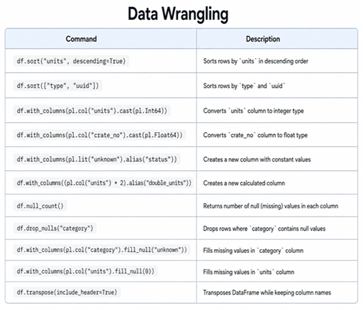

Data Wrangling
==============

Cargo Bay
---------

.. card::
   :shadow: lg

   Ilmar stepped into the ships storeroom. 
   "I need some size 15 screws, they should be here". 
   A shelf with open and half-open cargo boxes stood in the middle of the room as if it had been left there in a hurry. 
   More cargo boxes were not very neatly piled up along the walls.
   When Ilmar stepped towards the shelf, he suddenly tripped over another box. 
   He toppled over, rolled through the room and crashed into the shelf. 
   The room collapsed in an avalanche of boxes and their content: tools, screws, rubber joins, fish tins and lots of other stuff.

   When the dust settled, Ilmar raised his head from the debris. "Holy Polar," he muttered, "I guess I will have to clean up here."

   Looks like it’s time to sort out the chaos in :download:`cargo.csv`. 

----

Sort rows
---------

Sort a DataFrame by:

.. code:: python

   df.sort("category")

to sort by more than one column, try:

.. code:: python

   df = df.sort(["category", "type"], descending=[False, True])

Rename a column
---------------

There are all kinds of reasons for renaming columns. 
The ``alias()`` expression adds a new column with the same data.

.. code:: python

   df.with_columns(pl.col("crate_no").alias('crate_number'))

Drop a column
-------------

The ``drop()`` method removes one or more columns:

.. code:: python

   df.drop(pl.col("column_2"))

   df.drop(pl.col("column_2", "column_3"))

Change the data type
--------------------

Converting values to integers is a very frequent operation:

Convert values to strings, replacing the old column:

.. code:: python

   df.with_columns(pl.col("crate_str").cast(pl.Int64))

.. code:: python

   df = df.with_columns(pl.col("crate_no").cast(pl.Utf8).alias("crate_str"))

Instead of replacing, you might want to create a new one:

.. code:: python

   df = df.with_columns(pl.col("crate_no").cast(pl.Utf8).alias("crate_str"))

You can easily combine multiple columns using string concatenation:

.. code:: python

   df = df.with_columns((
      pl.col("crate_no").cast(pl.Utf8) + pl.col("crate_shelf")
      ).alias("crate_id"))

Create new rows
---------------

If you have Python sequence types (lists, tuples, sets), you can assign them to new columns directly.
The only prerequisite is that the length matches that of your DataFrame:

.. code:: python

   deck = [d for _,d in zip(range(df.shape[0]), cycle("123"))]  # repeat 1,2,3,1,..
   df = df.with_columns(pl.lit(deck).alias("deck")) 

Missing values
--------------

Missing values are a common phenomenon. A quick way to diagnose missing
values is:

.. code:: python

   from matplotlib import pyplot as plt

   nulls = df.null_count()
   
   plt.bar(nulls.columns, nulls.row(0))
   plt.xticks(rotation=45, ha="right")
   plt.tight_layout()
   plt.show()

Often, you might simply want to kick out all rows in which a None or NaN
occurs:

.. code:: python

   df_dropped = df.drop_nulls()

Alternatively, you might want to fill in a best guess value:

.. code:: python

   df_fixed = df.with_columns(pl.col("units").fill_null(pl.col("units").median()))

There are many, many strategies to fix missing values (imputation
methods).

Swap rows and columns
---------------------

Some operations (especially plotting) are easier to implement if you
turn a DataFrame by 90°:

.. code:: python

   df.transpose()

Iterate
-------

Usually, it is possible to write one-liners or concise expressions that
get the job done. If this is not possible (or you are still learning
this stuff and can’t figure out a better way yet), you may want to fall
back to a ``for`` loop over all the rows.

.. code:: python

   for i, row in enumerate(df.iter_rows(named=True)):
       print(i, row['type'])

Challenge
---------

.. card::
   :shadow: lg

   Take care of the following clean-ups in the cargo docs :download:`cargo.csv`:

   - for the radioactive waste, replace the words in the `units` column by numbers
   - convert the `units` column to the type `int`
   - fill the missing values in the `category` column for the bamboo ice cream
   - fill the missing values in the `units` column
   - sort the crates by type and by identifier in ascending order
  