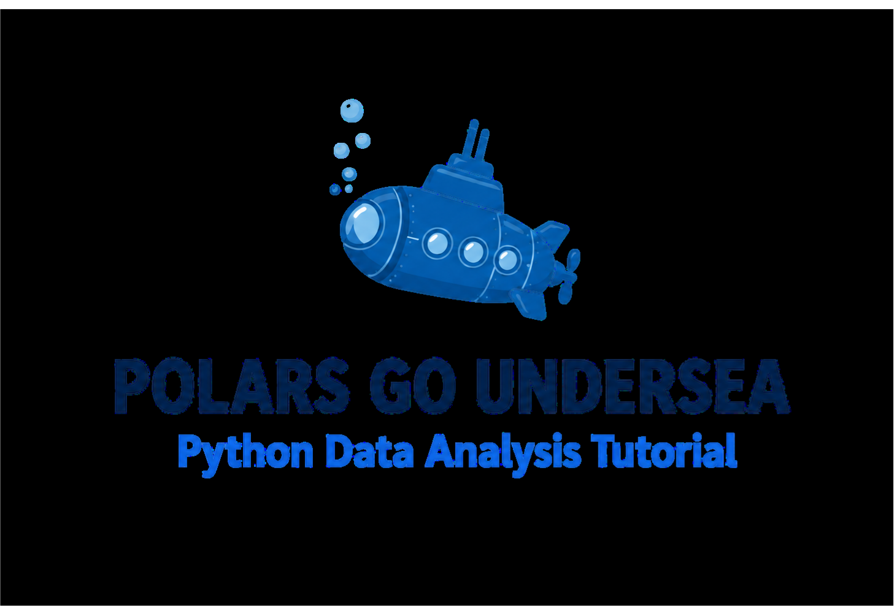
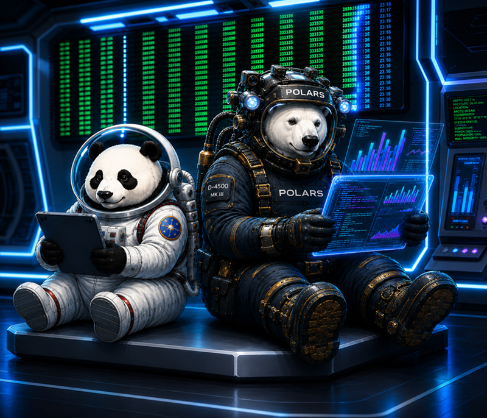

.. polars_go_undersea documentation master file, created by
   sphinx-quickstart on Sat May 08 10:05:39 2026.
   You can adapt this file completely to your liking, but it should at least
   contain the root `toctree` directive.

.. card::
   :shadow: lg

   Long long ago, beneath the eternal ice of the northern seas, 
   there lived polar bears traveling the oceans in mighty submarines. 
   They were fearless explorers and skilled data scientists. 
   The polar bears would dive into the depths to discover hidden worlds full of data, 
   to analyze and plot that data, and to uncover rare Arctic delicacies no creature had tasted before.

This is a Python tutorial featuring the `polars <https://pola.rs/>`__ library.
It focuses on the technical basics of Data Science – working with tabular data.
On the way, you will help the polar bears explore deepsea.

Contents
--------

.. toctree::
   :maxdepth: 1

   preparations/README.rst
   read_write_data/README.rst
   inspect_data_frames/README.rst
   select_rows_and_columns/README.rst
   data_wrangling/README.rst
   plotting/README.rst
   descriptive_statistics/README.rst
   pivots/README.rst
   edit_columns/README.rst
   string_handling/README.rst
   time_series/README.rst
   plotting_maps/README.rst
   create_data_frames/README.rst
   long_vs_wide/README.rst
   aggregation/README.rst
   database/README.rst
   dashboard/README.rst
   hall_of_fame.rst
   links.rst

Challenges
----------

.. toctree::
   :maxdepth: 1

   challenges/powerful_pivots.rst
   challenges/babynames/read_data.rst
   challenges/babynames/timeline.rst
   challenges/babynames/last_letters.rst
   challenges/climate_stripes/README.rst
   challenges/titanic.rst
   challenges/gapminder/README.rst
   challenges/pingubase/README.rst
   challenges/pagerank/README.rst

Image Sources
-------------

Most images for this tutorial were created with the generative neural networks `ChatGPT <https://chatgpt.com/>`__  and `Canva <https://www.canva.com/>`__

License
-------

© 2026 Shreyaasri Prakash and Kristian Rother

Unless stated otherwise, the content of this tutorial may be used under the conditions of the **Creative Commons Attribution Share-Alike License 4.0 (CC-BY-SA 4.0)**. 
See `creativecommons.org <https://creativecommons.org/licenses/by-sa/4.0/>`__ .

Acknowledgements
----------------

I would like to thank the following people for inspiring exchange on training and Python that this material has benefited from: Jasmin Touati, Veit Schiele, Dinu Gherman, Pedro Fernandes, Tomasz Puton, Edward Jenkins, Bernard Szlachta, Robert Lehmann, Allegra Via, Kaja Milanowska, Anna Philips, Paul Wlodkowski, Tom Gadsby, Stefan Roth, Gesa Johannsen, Ugur Ural, Malte Bonart, Paula Gonzalez, Samuel McGuire, Sara Maras, Carmine Somma, Kiran Challa, Dina Deifallah, Marija Vlajic, Emely Henninger and Magdalena Rother.