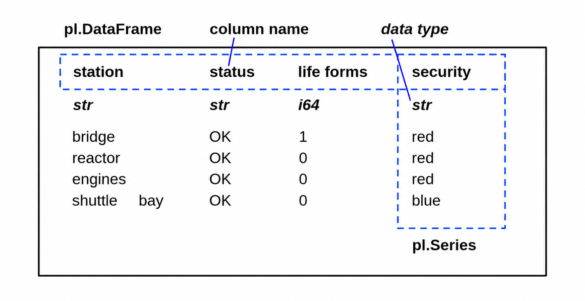
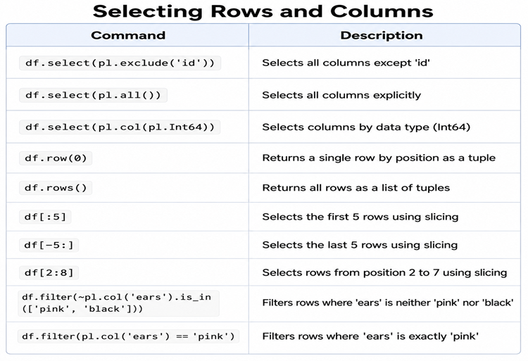

Inspect DataFrames
==================

.. card::
   :shadow: lg

   **Captain’s Inspection**

   Aarla went for a round of inspection through the ship. 
   She always did before departing on a journey. 
   It was a captains responsibility to make sure every room was in order. 
   Also, there should be some tasty fish soup in the fridge! ...

   The ships computer has prepared a **tabular report** already.
   All you need to do is to see what is in the table.
   
   Fasten your seat belts and load the report :download:`stations.csv` into a `DataFrame` and check the following commands.

----

What is a DataFrame?
--------------------

The class `polars.DataFrame` is the central data structure in `polars`.
You can think of it as a table of data, with columns (each of a specific type) and rows.
Unlike pandas, Polars does not have an implicit index; all data is stored in columns, and if you want an “index,” you create it explicitly. Each column is a `polars.Series`.
Polars is designed for high-performance and parallel computation, making it especially fast on large datasets.

----

Inspect a few rows
------------------

You might want to see a few rows. 
In Jupyter, you can do that by typing the variable name in a cell. 
In a Python script, you could `print(df)`.
But you could use the more explicit methods `head()` and `tail()`:

.. code:: python

   df.head(3)
   df.tail(3)

.. dropdown:: Can I call `head()` and `tail()` without a number?
   :animate: fade-in

   Yes. The default number if you leave away the argument is 5.

----

Number of rows and columns
--------------------------

The shape of a `DataFrame` is alway a tuple of two integers `(rows, columns)`.

.. code:: python

   df.shape

.. dropdown:: When do I need to check `df.shape`?
   :animate: fade-in

   `df.shape` is your most important command when debugging.
   If the shape is not what you expect, everything is wrong.

----

Data types
----------

When you load data from a CSV file, `polars` automatically infers data types.
Sometimes a single wrong value converts a numerical column to strings.

.. code:: python

   df.dtypes

.. dropdown:: What does the type `object` mean?
   :animate: fade-in

   The type `object` usually means that the column contains strings.

----

Generic overview
----------------

Polars prints the table by default with data types, so often df is already enough for a quick overview.
You can check data types, the number of entries for each column :

.. code:: python

   df
   df.glimpse()

.. dropdown:: How to check the memory size of a DataFrame?
   :animate: fade-in

   The df.estimated_size() method returns the approximate memory usage of the DataFrame. 
   By default size is shown in bytes. Specify 'mb' to display the result in megabytes

----

Unique values
-------------

With categorical columns, you might want to know, what are the most frequent values or what different values occur.
This also helps you to identify some data errors.

.. code:: python

   df['column_name'].value_counts()

If you are not interested in the count, check the unique values:

.. code:: python

   df['column_name'].unique()

----

Challenge
---------

.. card::
   :shadow: lg

   Inspect the report :download:`stations.csv`. Solve the following tasks

   - display the number of rows and columns
   - display the last 5 rows
   - list the column names
   - how many life forms are there on the bridge?
   - how many stations does the ship have?
   - how many different security levels are there?
   - there is one life support value that is neither 0 or 100%. How much is it? 
