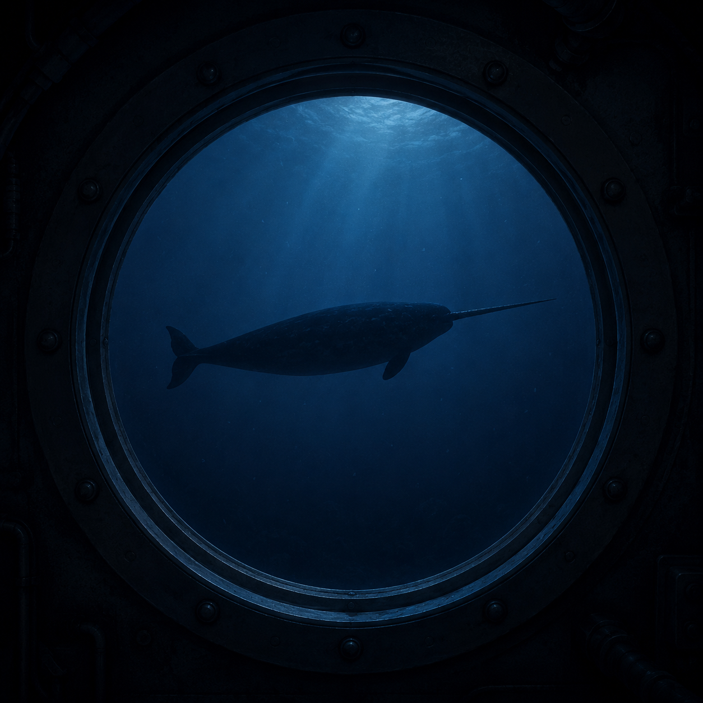

Narwhals
========

.. _create-dataframes-and-series-1:

.. card::
   :shadow: lg

   **A noteworthy encounter**

   *"Captain, I think we are being followed."*

   Aarla and Lumi are looking through the bullseye at the silhoutte gently gliding through the waters behind them.
   Ming Ming is there as well, cleaning.

   *"That creature has been there for a while. What is it even, a unicorn? Set course towards it, let's see how it react."*

   As the heavy submarine turns around, the bears hear a voice in their heads:

   *"We are the Narwhals. Fear is futile. Prepare to be translated."*

   Of course, Ming Ming hears:

   *"我们是独角鲸。恐惧是徒劳的。准备好被翻译吧。"*

   The captain comments:

   *"Aye, seems we have found ourselves a telepath."*

What is Narwhals?
-----------------

The ``narwhals`` library translates between multiple DataFrame libraries and offers a common interface.
It supports pandas, Polars, PyArrow, cuDF, Modin and to some extent DuckDB, Dask and others.

Install it with:

.. code::

    pip install narwhals

Reading from polars
-------------------

Now you can create a narwhal DataFrame from your polars DataFrame:

.. code:: python

   import narwhals as nw

   df_nw = nw.from_native(df)
   df_nw.columns

Most of the functions in ``narwhals`` work the same as in ``polars``.

Narwhals supports lazy evaluation by default, so the ``df_nw`` will not show you anything.
To see the data, convert it back to ``polars`` with:

.. code:: python

   df_nw.head().to_native()

Reading from pandas
-------------------

The useful part is that if your DataFrames come from somewhere else, the same code will work.
Here is some pandas code:

.. code:: python

   import seaborn as sns

   df = sns.load_dataset("penguins")
   df_nw = nw.from_native(df)

.. seealso::

    For more examples and full documentation, see:

    - `narwhals-dev.github.io/narwhals/ <https://narwhals-dev.github.io/narwhals/>`__
