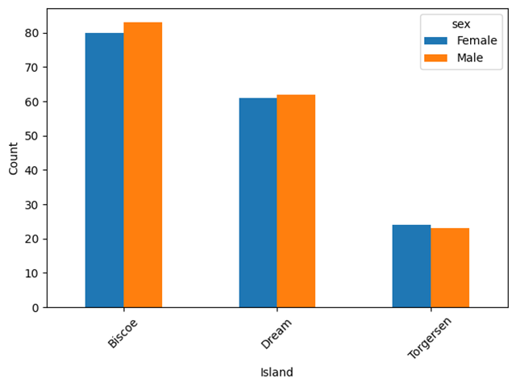

Pivot Tables
============

.. card::
   :shadow: lg

   **Penguin Tribes**

   The crew sits at the lunch table. Ilmar starts a conversation:
   
   *"Hey boss, I noticed something: those pingus, they are pretty much like us. They swim, they like cool water, they eat fish. They even have the same colors as Ming here. Just sayin'."*
   
   *"Yeah but with a different pattern, "* Boreaboy chips in, *"most of their fur looks like us, but they have these funny paws."*.

   Andromé joins the discussion: *"I think they have different patterns, maybe they are tattooed. Look, I made a drawing."*
 
   .. figure:: penguin_heads.png

   *Palmerpenguins Artwork by @allison_horst*

   Finally, Aarla concludes: *"Tattoo or not, we should find out more about them. Our folks at home will want to know. How far are we with the measurements?"*

   **Summarize the penguin data, considering the three different species.**

Load the data
-------------

Start by loading the penguin data:

.. code:: python3
   
   import seaborn as sns
   import polars as pl

   df = pl.from_pandas(sns.load_dataset("penguins"))
   df = df.drop_nulls()

Simple aggregations
-------------------

An **aggregation** is a generic summary of tabular data.
It creates a table where the rows are defined by one categorical column of the data.
As a result, there are much fewer rows, making the data much easier to plot.

To create a simple aggregation from your data, you need to have at least **one categorical and one numerical column and a function that aggregates data**:

::

   categories + numbers + aggregation function -> pivot

Let's examine one example: the mean bill length for each species:

.. code:: python

   df.group_by("species").agg(pl.col("bill_length_mm").mean())
      
Here, each distinct value in ``index`` results in a separate row. The ``values`` parameter defines which column will be used for aggregation.

Pivot Tables with rows and columns
----------------------------------

A **pivot table** is a well-known tool from spreadsheet applications.
In contrast to simple aggregations, you will use two categorical columns so that the pivot table has multiple columns.
In that case, one categorical column defines the rows, the other defines the columns of the pivot table:

::

   categories1 + categories2 + numbers + aggregation function -> pivot

The ``pivot()`` method allows to specify all of these in one call:

.. code:: python3

   df.pivot(
      values="bill_length_mm",
      index="island",
      on="sex",
      aggregate_function="len"
   )

The ``on`` parameter lets each distinct gender result in a separate column.
Counting works with any column as ``values``, but ``None`` is ignored.

Aggregation Functions
---------------------

There are just a few aggregation functions that cover most statistical functions:

- len
- sum
- mean
- std (the standard deviation)
- min
- max

You could use your own functions with ``pl.pivot`` but this is out of scope for this tutorial.

Normalizing
-----------

When creating pivot tables with count data, you often will want to know the **relative frequencies** or **percentage** of each item. This is an example of **normalizing data**.

Assume we have the pivot:

.. code:: python3

   piv = df.pivot(
      values="bill_length_mm",
      index="island",
      on="sex",
      aggregate_function="len"
   )

You can normalize over the rows, so that the relative frequencies sum up to 1.0 for each island:

.. code:: python3

   piv.with_columns(
       pl.col("Male") / pl.sum_horizontal(pl.col("Male"), pl.col("Female")),
       pl.col("Female") / pl.sum_horizontal(pl.col("Male"), pl.col("Female"))
   )

If you want to normalize for each gender instead, you need to transpose the table first:

.. code:: python3

   piv.with_columns(
       pl.col("Male") / pl.col("Male").sum(),
       pl.col("Female") / pl.col("Female").sum()
   )

Finally, to normalize the entire table, so that everything adds up to 1.0, you need to divide by the **grand total**:

.. code:: python3

   # select columns to sum up explicitly
   total = piv.select(pl.sum_horizontal(pl.col("Male"), pl.col("Female"))).sum().item()

   # alternative: select numerical column s
   total = piv.select(pl.col(pl.UInt32)).sum().sum_horizontal().item()

   piv.with_columns(
       pl.col("Male") / total,
       pl.col("Female") / total
   )

Bar Plots
---------

One key feature of pivot tables is that they reduce the size of the data considerably.
The pivoted data usually can be displayed well as a **bar plot**: 

.. code:: python3

   piv.plot.bar()

This works for all pivots and their normalizations!

Challenge
---------

.. card::
   :shadow: lg

   Examine the penguin data further:

   .. code:: python3

      import seaborn as sns

      df = sns.load_dataset('penguins')

   Answer the following questions:

   1. how many penguins are in which species?
   2. how many penguins from which species live on which island?
   3. what is the average body mass of each species?
   4. how long is the longest beak of each species?
   5. what is the mean of each numerical column, per species?
   6. what is the mean bill length and depth for each species/sex combination?
