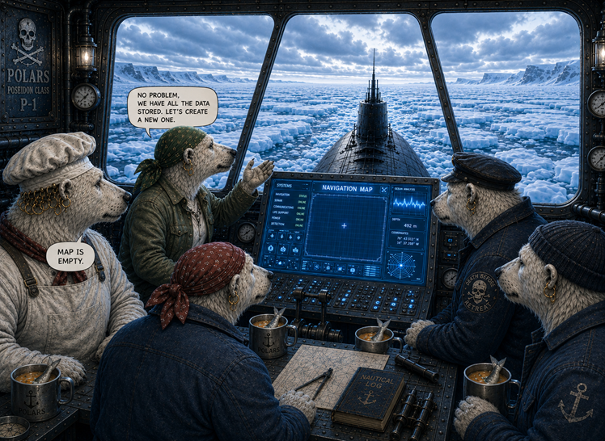
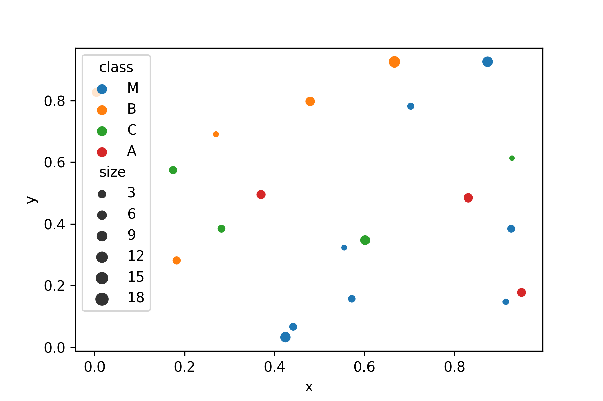

High-Quality Plots
==================

.. card::
   :shadow: lg

   **Navigation**

   After a few days, the ship reached the eternal ice. 
   The polar bears took a last look at the sun and took a deep breath. 
   Then they went under deck, closed the hatch and secured it. 
   Andromé addressed the rest of the crew: 
   
   *"Listen up. We will travel underwater for at least two weeks. 
   From time to time we will need to get to the surface and take up fresh air. 
   There are plenty of holes in the ice, we just need to visit a few of them. 
   Here, take a look." She pressed a key on the console."*

   Boreaboy looked at the screen sceptically. *"What's on?"*, Andromé asked. 
   *"Your map is empty"*, Borea replied.
   
   *"Holy crab, I think we need to generate a new one."*

   **Plot a high-quality navigation map from the raw data.**

----

Step 1: Import packages
-----------------------

When using the polars/matplotlib/seaborn stack, your imports should look as follows:

.. code:: python

   import polars as pd
   import seaborn as sns
   from matplotlib import pyplot as plt

----

Step 2: Start with clean data
-----------------------------

Many problems with plotting result from unclean data.
Make sure the data you are using is clean and consistent:

* make sure columns and rows are labeled
* check the data types of the columns you want to plot
* few missing values
 
polars by default kicks out rows with missing data when plotting, but for your final plots you want to be firmly in control.
Here is a clean version of the holes in the **penguin sector:** :download:`penguin_sector.csv <../read_write_data/penguin_sector.csv>`

.. code:: python

   df = pl.read_csv('penguin_sector.csv')

----

Step 3: Plot with default settings
----------------------------------

Use one of the standard `seaborn` functions to check whether the data contains what you need.
Most parameters of `seaborn` refer directly to column names:

.. code:: python

   sns.scatterplot(data=df, x='x', y='y', hue='class', size='size')

For an exploratory analysis, the default polars functions are also a valid starting point, but they have fewer options:

.. code:: python

   df.plot.scatter(x='x', y='y')

To improve the plot, use `matplotlib`, a library that `seaborn` are based on.

----

Step 4: Format the axes
-----------------------

You may want to adjust the axis limits to add a bit of empty space on the sides.
After all, there is plenty of empty space in space.
Also, you may want to label each axis. 
Note that you may use *LaTeX math notation*. 

.. code:: python

   sns.scatterplot(data=df, x='x', y='y', hue='type', size='size')
   plt.xlim(-10, 110)
   plt.ylim(-10, 110)
   plt.xticks(color="white")
   plt.yticks(color="white")
   plt.tick_params(color="white")
   plt.xlabel("x", color="white")
   plt.ylabel("y", color="#ffffff")
   plt.xticks(color="white")

.. hint::

   In this example, we decided not to use *longitude* and *latitude* to match the story.
   With real geocoordinates you would have to use proper map projections.
   There are other Python libraries like ``folium`` that can plot map data properly.

----

Step 5: Add a grid
------------------

A grid makes it easier to see the x/y values.

.. code:: python

   sns.scatterplot(data=df, x='x', y='y', hue='type', size='size')
   plt.grid()

----

Step 6: Add points of interest
------------------------------

For navigation, you will want to highlight the position of the submarine.
It is currently at the border of the penguin sector.
Let's mark it on the nav map with a big arrow, so that Boreaboy is happy.

.. code:: python
   
   sns.scatterplot(data=df, x='x', y='y', hue='type', size='size')
   
   plt.annotate('our position$',
                xy=(0.6, 0.6),
                xycoords='data',
                xytext=(-90, -50),
                textcoords='offset points',
                fontsize=12,
                color="blue",
                arrowprops={
                    'arrowstyle': "->",
                    'connectionstyle': "arc3,rad=.2",
                    'color': "red"
                })

----

Step 7: Add a title
-------------------

This step is crucial to understand the plot.
You want everybody to be clear in which sector we are even if they overslept their shift.

.. code:: python

   sns.scatterplot(data=df, x='x', y='y', hue='type', size='size')
   plt.title('Penguin sector with ice holes', color="black")

----

Step 8: Figure size
-------------------

You may want a bigger image on the screen so that the bears in the back of the bridge can see everything.
For historic reasons, the size of matplotlib figures (and submarine screens) is measured in inches.

.. code::

   plt.figure(figsize=(11, 7))
   sns.scatterplot(data=df, x='x', y='y', hue='class', size='size')

----

Step 9: Export the image
------------------------

Finally, make the map available as an image file. Here is where you define the final resolution in pixels.
To convert from inches to pixels, the starfleet uses the ancient metric `dpi` (dots per inch):

.. code::

   pixels = figure size inches * dpi

A number of image formats including png, jpg and svg are available.

.. code:: python

   plt.savefig("sector_map.png", dpi=300)

----

Challenge
---------

.. card::
   :shadow: lg

   Create a big scatterplot from the ice holes from all three sectors.
   Apply the code from all steps above and fine-tune the image.   

   **data:**
   
   - :download:`panda_sector.csv <../read_write_data/panda_sector.csv>`
   - :download:`penguin_sector.csv <../read_write_data/penguin_sector.csv>`
   - :download:`amoeba_sector.csv <../read_write_data/amoeba_sector.csv>`
