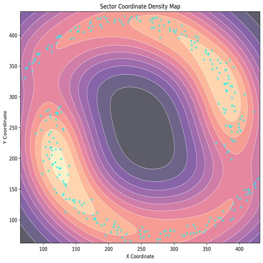

Read and Write Data
===================

.. card::
   :shadow: lg

   **Navigation Map Data**

   The submarine was safely in the harbor. The ship’s computer was up and running.
   It was time to inspect the course for the journey. Aarla pulled out three boxes. 
   They contained data discs with maps of the known parts of the ocean. 
   All she needed to do was load the data into the ship’s computer. 
   Of course, the crew had bought the maps in some shady corner of the
   harbor, so the data was far from standardized.

   Before the submarine can travel anywhere, you need to set a course. To find out
   where you are going, you want to load the map data from all three regions:

   :download:`panda_sector.csv`

   :download:`penguin_sector.xlsx`

   :download:`amoeba_sector.json`

----

Read CSV files
--------------

The ``read_csv`` function is often the first command used. It has a lot
of optional parameters, two of which are shown here:

.. code:: python

   import polars as pl

   df = pl.read_csv('panda_sector.csv', separator=',', has_header=True)

``df`` is a **DataFrame**, a fundamental data structure in pandas.
For most practical matters, it works like a table.

.. dropdown:: How can I check what is in a DataFrame?
   :animate: fade-in

   After reading data into a DataFrame, you might want to see what is inside.
   It is a good idea to do that right away.
   In Jupyter, you would type into a cell:

   .. code:: python

      df

   and in a regular Python script you need an extra ``print`` statement:

   .. code:: python

      print(df)

   To see the number or rows and columns, use:

   .. code:: python

      df.shape

   Use ``print()`` in the same way outside Jupyter.
   This won't be mentioned from now on.

----

Read Excel files
----------------

Polars does not have a native Excel reader. Instead, it uses an external library called an "engine" to parse Excel files into a form that Polars can parse.
Here, we are using the default fastexcel engine. The xlsx2csv and openpyxl engines are slower but may have more features for parsing tricky data.

.. code:: python

   df = pl.read_excel('penguin_sector.xlsx', engine='fastexcel')

.. note::

   You may need to install an extra library to read Excel files.
   If you get error messages about missing dependencies, try installing the fastexcel engine:
   
   pip install fastexcel

----

Read SQL
--------

You will need to create a DB connection first. Requires installing the
SQLAlchemy package and a DB connection package, e.g. ``psycopg2`` for
PostGreSQL

.. code::

   pip install psycopg2-binary
   pip install sqlalchemy

Once the library is installed, you can send SQL queries to your database and get the results as a DataFrame:

.. code:: python

   from sqlalchemy import create_engine

   conn = create_engine('postgressql//user:psw@host:port/dbname')
   df = pd.read_database('SELECT * FROM penguins', conn)

----

Read JSON
---------

Polars expects JSON to be row-oriented. 
If the JSON file contains column-oriented nested dictionaries, you must convert it to rows first.

.. code:: python

   import json
   
   with open("amoeba_sector.json") as f:
      data = json.load(f)
   
   rows = [
    {col: data[col][idx] for col in data}
    for idx in data["name"]
   ]
   df = pl.DataFrame(rows)

If the JSON is already row-oriented, you can read it directly

.. code:: python

   df = pl.read_json('amoeba_sector.json') 

----

Read from Clipboard
-------------------

This is sometimes useful when improvising.
In Polars, there is no direct read_clipboard() function like in pandas. 
But you can easily achieve the same thing by reading the clipboard text and passing it to Polars.

.. code:: python

   df = pl.from_pandas(pd.read_clipboard())

----

Concatenate multiple DataFrames
-------------------------------

When reading multiple tabular files that have the same structure,
it is sometimes straightforward to combine them into a single `DataFrame`:

.. code:: python

   df = pl.concat([df1, df2, df3, ...])

----

Writing Files
-------------

For writing a DataFrame to an output file, there is an equivalent set of functions:

.. code:: python

   df.write_csv("planets.csv")

   df = df.with_row_count("index") # add an index column
   df.write_csv("planets_polars.csv")  

   df.write_excel("planets.xlsx")
   
   df.write_json("planets.json")

.. seealso::

   `Polars I/O reference <https://docs.pola.rs/api/python/stable/reference/io.html>`__

----

Challenge
---------

.. card::
   :shadow: lg

   How many planets are there in all three star maps combined?

----

.. include:: seven_lines_roundtrip.rst

----

.. dropdown:: Where do the planet names come from?
   :animate: fade-in

   The planet names (:download:`names.txt`)
   were scraped from `everybodywiki.com <https://en.everybodywiki.com/List_of_Star_Trek_planets_(A%E2%80%93B)>`__ .
   The galaxy coordinates were generated with the following script:

   .. literalinclude:: create_galaxy.py
