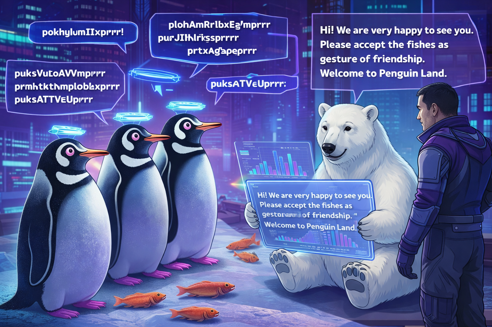

String Handling
===============

Diplomacy
---------

.. card::
   :shadow: lg

   You finally make direct contact with the mysterious penguins.
   Their delegates meet yours. They are standing neatly in a row in front of you.
   Boreaboy blurts out:

   *"There is one for each of us – come on, let's eat!"*
   
   Aarla rolls her eyes. 

   *"You know very well that we are not eating civilized beings. And I don't want feathers everywhere. We should try to make contact."*

   The meeting turns out a bit frosty. One penguin in the middle steps forward and places a tiny fish in front of the polar delegation.
   Is that all they have to offer? Then they start chattering in a strange high-pitched language:

   .. code::

      pokHaELlRlnoXprrr purSAtfrQADnLgXeCprrr pukCprpEaAmtcuprZeSSEprrr
      pokwzIITihFprrr plofIUuRkprrr plosztnOfPhprrr prtWrEhprrr 
      pokayRYEdprrr prttqHOEJprrr plopPelnLGAUzIdNGShprrr ploSOtNOlPIprrr
      pukWreYprrr pukcCoUMpEFprrr purifnSprrr pukPrEXAgcaEJprrr prtSrTUOUPKprrr
      pokpilQeDAZScEmprrr purThAZKIeeprrr purTIhmiksUprrr ploTzAcsFTwYkprrr
      plofcIGsWhSprrr pokaesGprrr prtauprrr pokWAeOLVCfOUMoELprrr
      pukgGIOFITDprrr prtsKtROBPcprrr puksgHNaiLLLtprrr pukWsEqprrr
      poksYHCokwxprrr pokYLOzUFprrr pokTLOuprrr pukOBuhRdprrr
      puksvWuiZMYmpIQNfgyprrr purPxOuoYLEprrr puksYtlOHPWprrr
   
   The polar bears hold their ears in pain.
   Finally, the captain speaks:

   *"Er.. folks, did anyone understand anything? Was that even a language."*

   Seconds of silence. Boreaboy is licking his lips. Finally Ming Ming whispers from the back:

   *"I took a course in pingu-speak at the university. Should I translate?"*

   **Let's find out what the penguins have to say.**

----

Tokenization
------------

Let's feed the entire message into polars:

.. code:: python

   text = """pokhrEYLMLAohprrr ploWdoBRKledYprrr"""
   df = pl.DataFrame({'text': [text]})

You should have a ``DataFrame`` with a single row that contains the entire text.
Let's split the text into words.
The ``.str`` attribute of a ``pl.Series`` gives you an access point to Python string functions:

.. code:: python

   words = df.select(pl.col("text").str.split(" "))

Having a list inside a ``pl.Series`` is not too easy to read.
It is better to unfold every word into a single row:

.. code:: python

   s = words.explode("text")

And convert the resulting Series to a nicely indexed ``DataFrame``:

.. code:: python

   df = s.rename({"text": "words"}).with_row_index()

----

Slicing Strings
---------------

Your translation computer found out that every word starts with a **glacial phoneme**.
These are any of the syllables *"plo", "pok", "pur", "prt"* or *"puk"* describing the current temperature. Because your fur keeps you warm, you can ignore these.

Let's remove the first three characters.
You can use ``.str.slice()`` to slice the strings in the entire column:

.. code:: python

   df.select(pl.col("words").str.slice(3))

Every word ends with the syllable *"prrr"*, an **arctic morpheme** which means something like *"it's cold here"*. You obviously disagree, but for diplomatic protocol you will ignore these as well.

Every second character is a *prosodial psychronic phoneme* which is quite important in a conversation with other penguins, but in inter-species diplomacy you can leave it out as well.

Insert numbers for *start, stop* and *step* into the slicing expression
to get rid of all the morphemes and phonemes.

The map_elements approach with a lambda is the standard way to replicate complex string slicing in polars expressions.

.. code:: python

   df = df.select(
       pl.col("words").map_elements(
           lambda x: x[start:end:step]
       )
   )

Assign the result to a new column.

----

Case Conversion
---------------

Words in the penguin language consist of a mix of uppercase and lowercase characters.
The case indicates how much the speaker is freezing (lowercase=a little, uppercase=a lot).
The methods ``.str.to_uppercase()`` and ``.str.to_lowercase()`` allow to change case for an entire string column:

.. code:: python
   
   df.select(pl.col("words").str.to_lowercase())

Because of your dense fur, the cold doesn't affect you much.
Convert to everything to lower case.

----

Join Words
----------

Once Ming Ming is done translating all the words, you might want to put them into a single piece of text again.
In Polars, you can use the ``.str.join()`` method to join all strings in a column with a delimiter:

.. code:: python
   
   df.select(pl.col("words").str.join(" "))

----

Word Length
-----------

For a deeper scientific analysis of the penguin language, the word length might be useful:

.. code:: python

   df.select(pl.col("words").str.len_chars())

----

String Search
-------------

Strings in Polars columns can be searched with **Regular Expressions**.
You can use the ``.str.extract_all()`` function to find all matches with a regex pattern:

.. code:: python

   df.select(pl.col("words").str.extract_all(r'(?i)(h.e.l.l.o)'))

----

.. card::
   :shadow: lg

   **Translate Back**

   It is time to respond to the penguin delegation.
   Andromé and Ming Ming have developed an algorithm that translates the polar language back to penguin language:
   
   .. literalinclude:: translate_back.py
   
   **Write an appropriate response and translate it to pingu-speak.**
